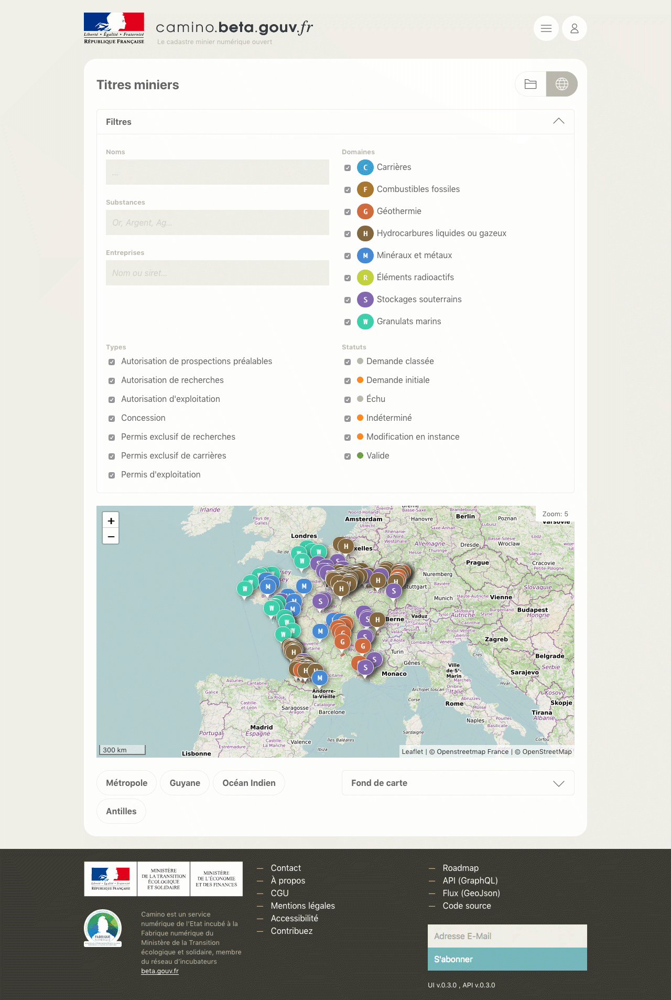

# Camino UI

[![Build Status][ci-img]][ci] [![codecov][codecov-img]][codecov] [![Dependency Status][dep-img]][dep]

[ci-img]: https://travis-ci.org/MTES-MCT/camino-ui.svg?branch=master
[ci]: https://travis-ci.org/MTES-MCT/camino-ui
[codecov-img]: https://codecov.io/gh/MTES-MCT/camino-ui/branch/master/graph/badge.svg
[codecov]: https://codecov.io/gh/MTES-MCT/camino-ui
[dep-img]: https://david-dm.org/MTES-MCT/camino-ui.svg
[dep]: https://david-dm.org/MTES-MCT/camino-ui

> Interface web de [Camino](https://camino.beta.gouv.fr), le cadastre minier numérique.



---

## Technologies

- [Vue.js](https://vuejs.org/)
- [Vuex](https://vuex.vuejs.org/)
- [Leaflet.js](https://leafletjs.com/)
- [Apollo GraphQl client](https://www.apollographql.com/docs/react/)
- [Vue-cli / webpack](https://cli.vuejs.org/)
- [Babel](https://babeljs.io/)
- [Postcss](https://postcss.org/)
- [Postcss-preset-env](https://preset-env.cssdb.org/)
- [Eslint](https://eslint.org/)
- [Prettier](https://prettier.io/)
- [Standardjs](https://standardjs.com/)
- [Stylelint](https://stylelint.io/)
- [Docker](https://www.docker.com/products/docker-engine)
- [Standard version](https://github.com/conventional-changelog/standard-version)
- [Commitizen](http://commitizen.github.io/cz-cli/)

---

## Configuration

1. Cloner ce repo : `git clone https://github.com/MTES-MCT/camino-ui.git`
2. Renommer les fichier `.env-example` en `.env` et le compléter.
3. Pour la version de développement, renommer le fichier et `.env.development-example` en `.env.development` et compléter.
4. Pour la version de production, renommer le fichier et `.env.production-example` en `.env.production` et compléter.

Pour plus d'informations sur les variables d'environnement, voir la doc de [vue-cli](https://cli.vuejs.org/guide/mode-and-env.html#modes).

### Installation

```bash
# installe les dépendances
npm install
```

### Développement

```bash
# lance un serveur de développement avec webpack-dev-server
# accessible à localhost:8080
npm run dev
```

### Production

```bash
# crée les fichiers de production dans le répertoire dist
npm run build

# lance le serveur de production
npm run start
```

---

## Contribution

Voir `contributing.md` (en anglais) pour plus d'infos.

---

## Credits

### Production

- [La Fabrique Numérique, Ministère de la transition écologique et solidaire](https://www.ecologique-solidaire.gouv.fr/inauguration-fabrique-numerique-lincubateur-des-ministeres-charges-lecologie-et-des-territoires)

### Équipe

- Guillaume Levieux, intrapreneur
- Joeffrey Arruyer, coach
- [François Romain](http://francoisromain.com), développeur

---

## Licence

Camino API, le cadastre minier numérique ouvert

[AGPL 3 ou plus récent](https://spdx.org/licenses/AGPL-3.0-or-later.html)
